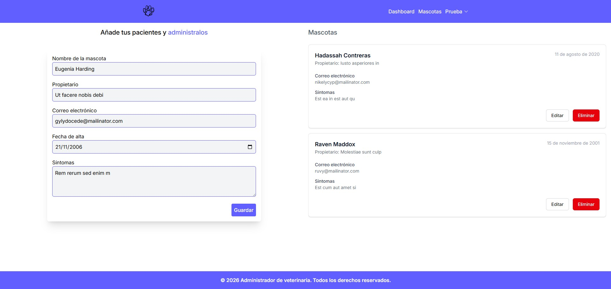
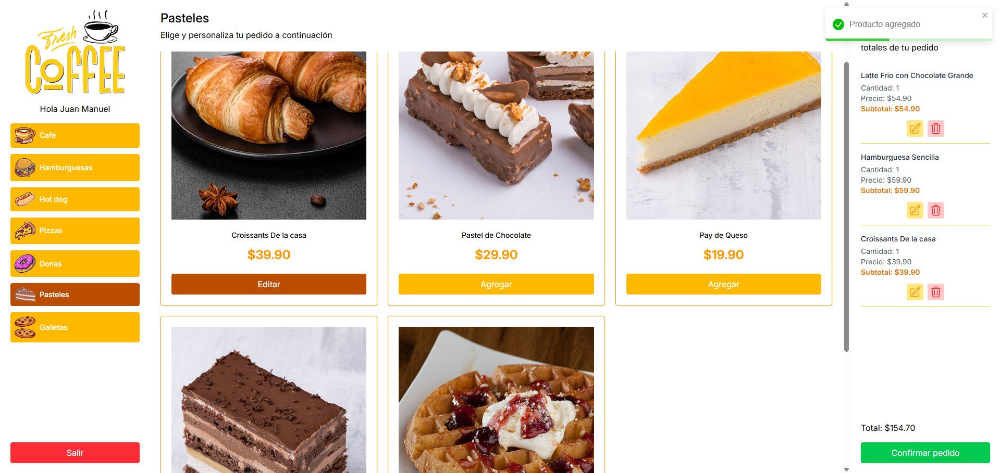
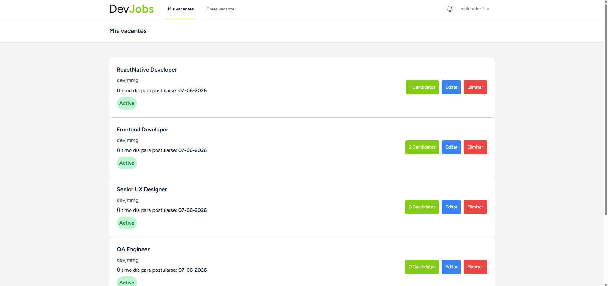

# Juan Manuel Martinez García
**Desarrollador Web Full Stack**

## 👨‍💻 Sobre mí

- Desarrollo de aplicaciones web utilizando React, TypeScript, Laravel, PHP y Node.js.
- Experiencia trabajando tanto en frontend como en backend.
- Integración de APIs, autenticación, manejo de estado y bases de datos.

## 🛠️ Tecnologías y herramientas

### Frontend

<table>
    <tr>
        <td align="center">
             
            React
        </td>
        <td align="center">
             
            TypeScript
        </td>
        <td align="center">
             
            JavaScript
        </td>
        <td align="center">
             
            HTML
        </td>
        <td align="center">
             
            CSS
        </td>
        <td align="center">
             
            Tailwind CSS
        </td>
    </tr>
</table>

### Backend

<table>
    <tr>
        <td align="center">
             
            Laravel
        </td>
        <td align="center">
             
            PHP
        </td>
        <td align="center">
             
            Node.js
        </td>
        <td align="center">
             
            Express
        </td>
    </tr>
</table>

### Bases de datos

<table>
    <tr>
        <td align="center">
             
            MySQL 
        </td>
    </tr>
</table>

### Herramientas

<table>
    <tr>
        <td align="center">
             
            Git
        </td>
        <td align="center">
             
            GitHub
        </td>
        <td align="center">
             
            Vite
        </td>
    </tr>
</table>

## 📌 Proyectos destacados

<table>
  <tr>
    <td width="50%" valign="top">

### 🐾 Administrador de Veterinaria

Aplicación web Full Stack para la gestión de usuarios y mascotas, desarrollada con React en el frontend y Node.js con Express en el backend.

**Tecnologías:** React · Tailwind CSS · Node.js · Express · Mongoose · JWT · Axios · Nodemailer · bcrypt

**Demo:** [Ver proyecto](https://manage-vet-jmmg.netlify.app/login)

**GitHub:** [Frontend](https://github.com/devjmmg/react-manage-vet) · [Backend](https://github.com/devjmmg/node-manage-vet/tree/main)

</td>

<td width="50%" valign="top">

### ✈️ Agencia de Viajes

Aplicación web para la gestión y presentación de destinos y paquetes turísticos, desarrollada con Node.js y Express utilizando el patrón MVC.

**Tecnologías:** Node.js · Express · Pug · Sequelize · MySQL · Tailwind CSS

**Demo:** [Ver proyecto](https://travels-va5m.onrender.com/testimonials/create)

**GitHub:** [Ver repositorio](https://github.com/devjmmg/travels)

</td>
  </tr>

  <tr>
    <td width="50%" valign="top">

### 🍔 Quiosco de Comida

Aplicación web para la gestión de pedidos de un quiosco de comida, desarrollada con React en el frontend y Laravel como backend mediante una API REST.

**Tecnologías:** React · Laravel · PHP · Tailwind CSS · SWR · Axios · React Router · Bearer Token

**Demo:** [Ver proyecto](https://react-kiosk-jmmg.netlify.app/login)

**GitHub:** [Frontend](https://github.com/devjmmg/kiosk-react) · [Backend](https://github.com/devjmmg/kiosk-laravel)

</td>

<td width="50%" valign="top">

### 💼 Plataforma de Vacantes y Postulaciones

Plataforma web para la publicación y gestión de vacantes, permitiendo a los usuarios registrarse, verificar su correo y postularse mediante la carga de su CV.

**Tecnologías:** Laravel 12 · Livewire 4 · PHP · Laravel Breeze · Blade Components · Tailwind CSS · MySQL · Mailtrap

**Demo:** [Ver proyecto](https://devjobs-jmmg.mnz.dom.my.id/)

**GitHub:** [Ver repositorio](https://github.com/devjmmg/devjobs)

</td>
  </tr>
</table>